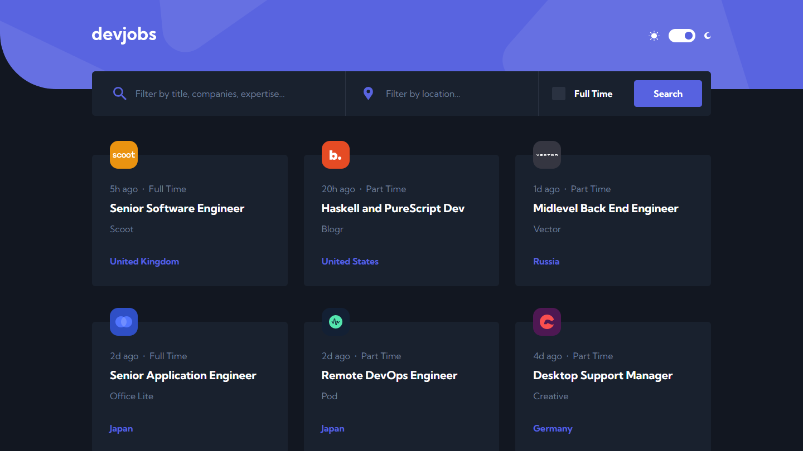
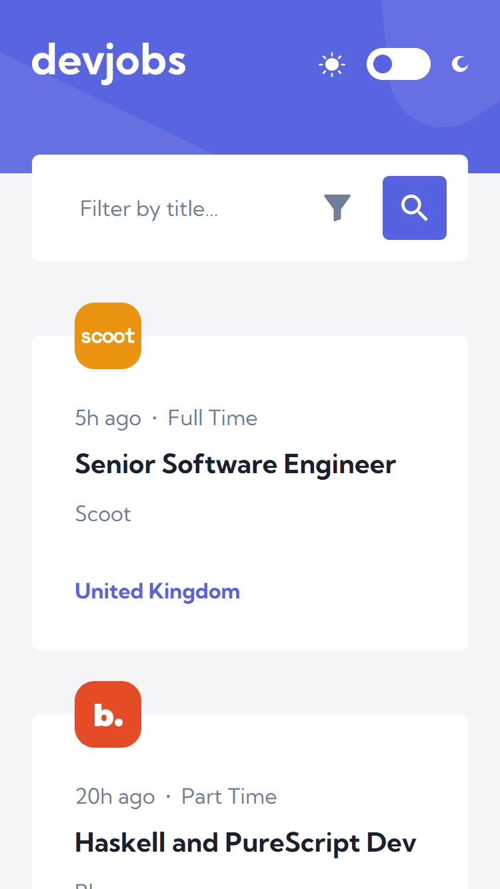

# Frontend Mentor - Devjobs web app solution

This is a solution to the [Devjobs web app challenge on Frontend Mentor](https://www.frontendmentor.io/challenges/devjobs-web-app-HuvC_LP4l). Frontend Mentor challenges help you improve your coding skills by building realistic projects.

View live site: [https://devjobs-crs.vercel.app/](https://devjobs-crs.vercel.app/)

## Table of contents

- [Overview](#overview)
  - [The challenge](#the-challenge)
- [My process](#my-process)
  - [Built with](#built-with)
  - [What I learned](#what-i-learned)
  - [Continued development](#continued-development)
  - [Useful resources](#useful-resources)

## Overview

### The challenge

Users should be able to:

- View the optimal layout for each page depending on their device's screen size
- See hover states for all interactive elements throughout the site
- Be able to filter jobs on the index page by title, location, and whether a job is for a full-time position
- Be able to click a job from the index page so that they can read more information and apply for the job
- **Bonus**: Have the correct color scheme chosen for them based on their computer preferences. _Hint_: Research `prefers-color-scheme` in CSS.

### Screenshots




## My process

### Built with

- Semantic HTML5 markup
- CSS custom properties
- Flexbox
- CSS Grid
- [BEM](https://en.bem.info/methodology/css/) - CSS methodology
- [Sass](https://sass-lang.com/) - CSS preprocessor
- [React](https://reactjs.org/) - JS library
- [Next.js](https://nextjs.org/) - React framework

### What I learned

This project includes a theme switch to choose between light and dark mode. I used CSS custom properties to reduce the amount of overrides needed when creating my components. For many components, there was no additional CSS needed to account for the theme.

```scss
body {
  --body-color: var(--gray-800);
  --color-light: var(--gray-500);
  --body-bg: var(--gray-200);
  --foreground: var(--gray-100);

  &[data-theme="dark"] {
    --body-color: var(--gray-100);
    --body-bg: var(--gray-900);
    --foreground: var(--gray-800);
  }

.card {
  background-color: var(--foreground);
  color: var(--color-light);
}
```

### Continued development

The app currently uses placeholder data, but I would like to get it working with an API to show real jobs.

### Useful resources

- [How to Create a Modal in React](https://dev.to/franciscomendes10866/how-to-create-a-modal-in-react-3coc) by Francisco Mendes
- [Dark Mode in CSS](https://css-tricks.com/dark-modes-with-css/) by Robin Rendle - This article showed how to make themes using CSS properties.
- [Next SEO](https://www.npmjs.com/package/next-seo) - I used this package for setting page titles, but there's a ton of features for SEO.
- [How TO - Toggle Switch](https://www.w3schools.com/howto/howto_css_switch.asp) by W3Schools - How to make a custom toggle switch with CSS
- [How To Create a Custom Checkbox](https://www.w3schools.com/howto/howto_css_custom_checkbox.asp) by W3Schools
